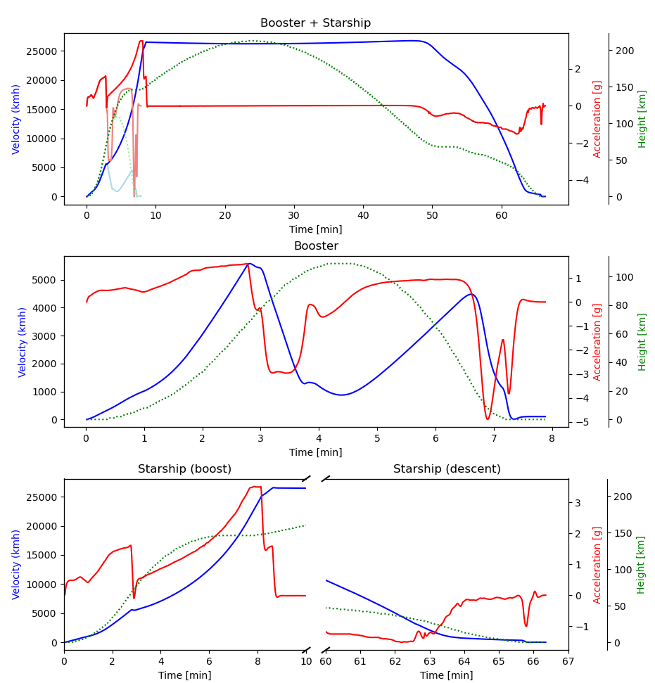

# IFT4 plot

This project contains some scripts I used to create an acceleration plot from the SpaceX integrated flight test 4,
of the booster+starship rocket.

## steps:

* downloaded  the video from twitter using yt-dlp 
the url: https://x.com/SpaceX/status/1798098040588480826
the video: Starship's Fourth Flight Test [1OwxWYzDXjWGQ].mp4

    6675.77  seconds -> 200273.10 frames

    Input #0, mov,mp4,m4a,3gp,3g2,mj2, from 'Starship's Fourth Flight Test [1OwxWYzDXjWGQ].mp4':
      Duration: 01:51:15.77, start: 0.000000, bitrate: 1444 kb/s
      Stream #0:0[0x1](und): Video: h264 (High) (avc1 / 0x31637661), yuv420p(progressive), 1920x1080, 1305 kb/s, 30 fps, 30 tbr, 90k tbn (default)
      Stream #0:1[0x2](und): Audio: aac (LC) (mp4a / 0x6134706D), 44100 Hz, stereo, fltp, 127 kb/s (default)

* used ffmpeg to sample an image every second from the video

    ffmpeg -i Starship\'s\ Fourth\ Flight\ Test\ \[1OwxWYzDXjWGQ\].mp4 -vf "fps=1" f/output_%04d.png

 -> f/output_NNNN.j

* used tesseract to OCR each image

    for f in f/*; do echo == $f == ; tesseract $f -; done > ocr-output.txt

 -> ocr-output.txt

* used filtertxt.py to extract values from ocr-output.txt
 -> measurements.dat

* manually fixed some errors, like swapped columns, and obviously incorrect values.

* used interpolate.py to linearly interpolate all missing values.
 -> interpolated.dat

* used kalman.py to generate the plot

NOTE that chatgpt wrote the kalman filter part for me.

    python3 kalman.py < interpolated.dat

## BUGS:

* I somehow cannot get rid of the tickmarks in the bottom right plot.

